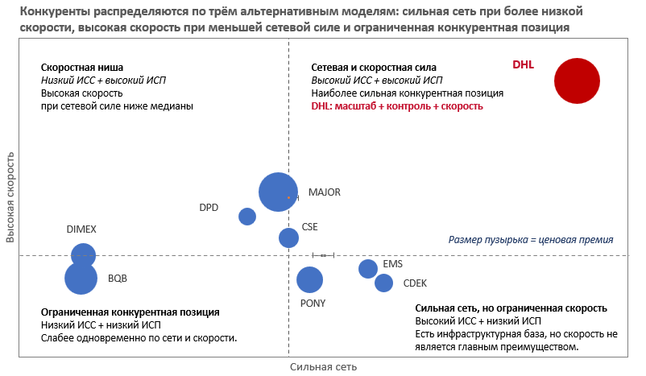
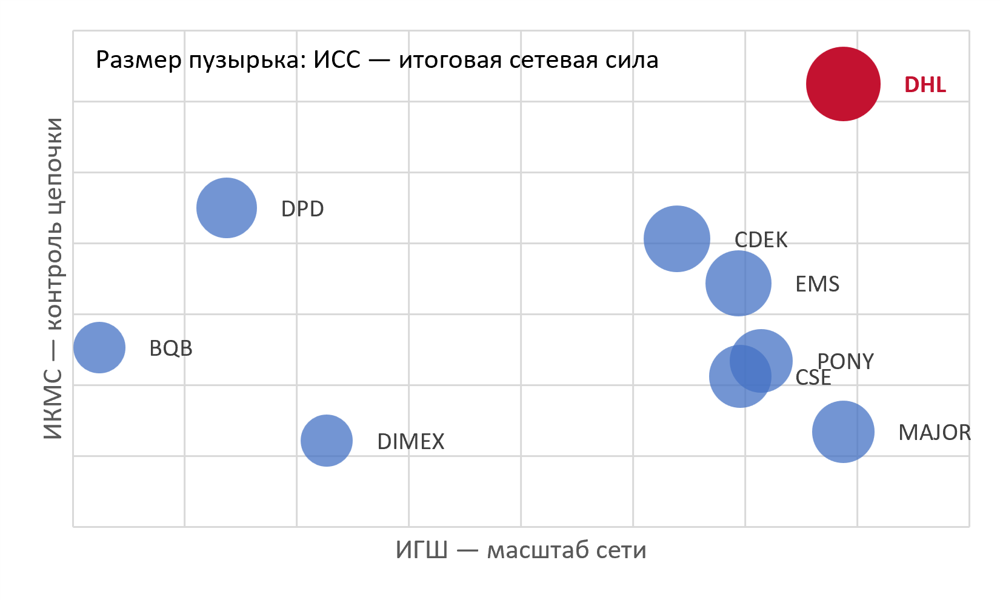
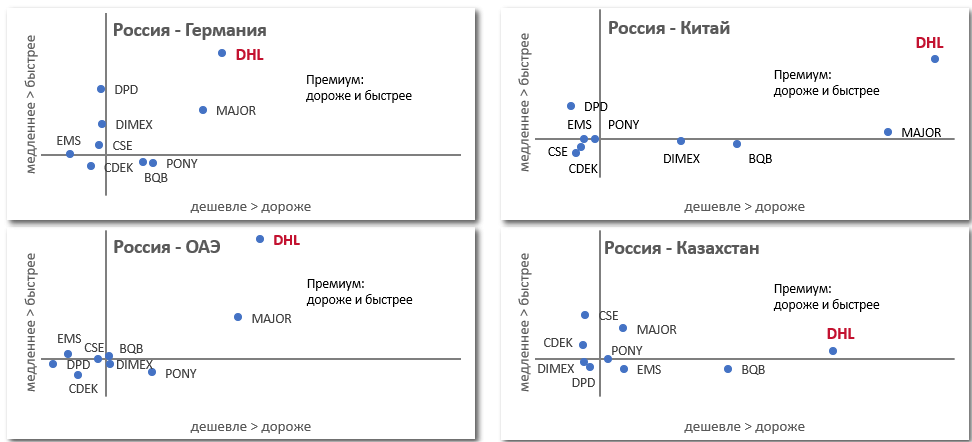
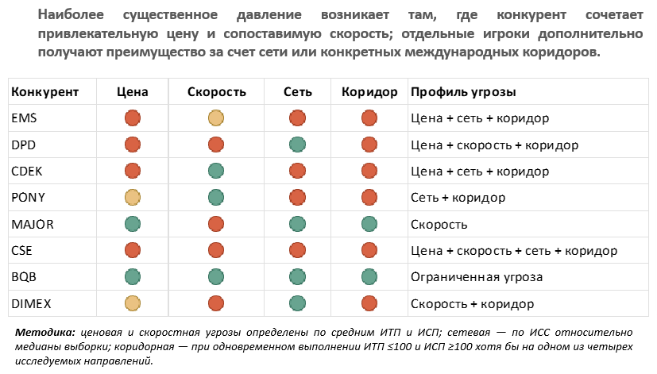

# Конкурентный анализ международной экспресс-доставки из России

## Competitor Battle File

> Портфолио-кейс по конкурентному анализу рынка международной экспресс-доставки из России.  
> Кейс демонстрирует методологию исследования, построение сравнительной аналитической модели и перевод результатов в бизнес-рекомендации.

---

## Кратко о проекте

Я построил конкурентную модель для сравнения 9 игроков рынка международной экспресс-доставки из России.

Задача — ответить не только на вопрос **«кто дешевле?»**, но и определить:

- насколько широка международная сеть игрока;
- насколько он контролирует международную цепочку;
- где он выигрывает по цене;
- где выигрывает по скорости;
- на каких коридорах возникает конкурентная угроза;
- за счёт чего DHL может обосновывать премиальное предложение.

В результате разрозненные операционные и коммерческие характеристики были объединены в систему индексов и конкурентных матриц.

### Основная логика модели

**География сети → контроль цепочки → сетевая сила → цена × скорость → конкурентная позиция → конкурентные угрозы → бизнес-рекомендации**

---

## Результат

Финальный Battle File объединяет:

- **9 игроков**
- **4 международных коридора**
- **5 весовых категорий**
- **2 сетевых индекса**
- **3 интегральных индекса**
- сравнительный анализ тарифов и сроков
- матрицу конкурентных позиций
- матрицу конкурентных угроз
- рекомендации по коммерческому позиционированию

### Финальная конкурентная карта

---

# Бизнес-задача

Основной вопрос кейса:

> **За счёт каких характеристик DHL может сохранять конкурентное преимущество на рынке международной экспресс-доставки из России и как отличить реальную конкурентную угрозу от локального или нишевого преимущества?**

Для ответа на него конкуренты сравниваются по четырём группам характеристик:

1. география и сеть;
2. контроль международной цепочки;
3. цена;
4. скорость.

Это позволяет перейти от простого рейтинга компаний к пониманию **механики конкурентного преимущества**.

---

# Охват анализа

### Игроки

| Игрок |
|---|
| DHL |
| EMS / Почта России |
| CDEK |
| DPD |
| PONY EXPRESS |
| Major Express |
| CSE |
| BQB |
| DIMEX |

### Международные коридоры

| Коридор |
|---|
| Россия → Германия |
| Россия → ОАЭ |
| Россия → Китай |
| Россия → Казахстан |

### Весовые категории

**0,5 / 2 / 5 / 10 / 30 кг**

---

# Методология

## 1. География и сеть

Для каждого игрока оценивались:

- международный охват;
- ключевые регионы;
- ключевые коридоры;
- транзитная архитектура;
- масштаб собственной сети в России;
- собственное присутствие за рубежом;
- партнёрская зависимость;
- модель международной консолидации;
- контроль таможенного процесса.

Цель блока — отделить простой **масштаб сети** от способности оператора контролировать международную инфраструктуру.

---

## 2. Контроль международной цепочки

Цепочка рассматривалась по отдельным звеньям:

**первое плечо в РФ → международный linehaul → международный хаб → таможенное оформление → зарубежная магистраль → последняя миля → трекинг**

Для каждого звена использовалась шкала контроля:

| Балл | Интерпретация |
|---:|---|
| 1 | Собственный контроль |
| 2 | Преимущественно собственный |
| 3 | Смешанный |
| 4 | Партнёрский |
| 5 | Полностью партнёрский |

Дополнительно оценивались:

- контроль трекинга;
- сквозной трекинг;
- количество накладных;
- зависимость от зарубежного партнёра;
- контроль SLA.

---

# Индексы

## Индекс географического охвата — ИГШ

ИГШ отражает масштаб и широту международной сети игрока.

Он отвечает на вопрос:

> **Насколько широка сеть оператора?**

---

## Индекс контроля международной сети — ИКМС

ИКМС объединяет пять субиндексов:

1. собственная международная сеть;
2. контроль партнёрского звена;
3. таможенный контроль;
4. сеть РФ;
5. контроль транзита.

Он отвечает на вопрос:

> **Насколько оператор контролирует международную логистическую цепочку?**

---

## Индекс сетевой силы — ИСС

ИГШ и ИКМС объединяются в итоговый показатель:

**ИСС = 40% × ИГШ + 60% × ИКМС**

ИСС позволяет сопоставить масштаб международной сети и глубину операционного контроля.

### Сетевая сила

---

# Цена и скорость

Для четырёх международных коридоров были сопоставлены полные тарифы на пяти весовых категориях:

**0,5 / 2 / 5 / 10 / 30 кг**

В анализ включались применимые надбавки и НДС.

Для оценки коммерческой привлекательности использовались:

### ИТП — индекс тарифной привлекательности

Показывает относительную привлекательность стоимости доставки.

### ИСП — индекс скоростной привлекательности

Показывает относительную привлекательность транзитного срока.

Чем выше значение индекса, тем привлекательнее предложение относительно исследуемой конкурентной выборки.

### Цена × скорость

---

# Итоговая конкурентная позиция

На финальном этапе показатели сетевой силы и скоростной привлекательности объединяются в матрицу:

**ИСС × ИСП**

Размер пузырька отражает **ИТП**.

Таким образом, одновременно учитываются:

- сила сети;
- скорость;
- тарифная привлекательность.

Это позволяет выделить четыре типа конкурентной позиции:

### Сетевая и скоростная сила

Высокая сетевая сила + высокая скоростная привлекательность.

### Скоростная ниша

Высокая скорость при более ограниченной сетевой силе.

### Сильная сеть, но ограниченная скорость

Высокая сетевая сила при менее привлекательной скорости.

### Ограниченная конкурентная позиция

Более слабая сеть и менее привлекательное скоростное предложение.

---

# Основные выводы

Модель показывает, что конкурентное преимущество в международной экспресс-доставке не сводится к тарифу или количеству обслуживаемых стран.

Ключевую роль играет сочетание:

> **география + контроль цепочки + скорость + цена**

### DHL

DHL занимает наиболее сильную совокупную позицию по сетевой силе и контролю международной цепочки.

### CSE

CSE формирует наиболее заметную конкурентную позицию среди игроков с более ограниченной собственной международной инфраструктурой, сочетая высокую скоростную привлекательность с относительно сильной сетевой позицией.

### DPD и Major Express

Имеют выраженное преимущество по скорости при более ограниченной совокупной сетевой силе.

### CDEK, PONY EXPRESS и EMS

Обладают сильной сетевой базой, но их конкурентная позиция ограничивается относительно более слабой скоростной привлекательностью.

### DIMEX

Занимает более узкую конкурентную позицию и не обладает сопоставимой с лидерами совокупной сетевой силой.

### BQB

Имеет наиболее ограниченную позицию по сочетанию сетевой и скоростной привлекательности в исследуемой выборке.

---

# Конкурентные угрозы

Важный вывод модели:

> **Не каждый сильный конкурент является одинаково опасным для DHL.**

Угроза определяется не только итоговым рейтингом игрока, но и тем:

- на каком коридоре он работает;
- за счёт чего выигрывает;
- с каким клиентским сегментом пересекается;
- насколько его преимущество связано с ценой, скоростью или сетью.

Поэтому конкуренты были дополнительно классифицированы по типу угрозы.

---

# Бизнес-импликации

## 1. Не конкурировать только ценой

Сетевая инфраструктура и контроль международной цепочки позволяют обосновывать премию характеристиками, которые сложнее воспроизвести простым снижением тарифа:

- предсказуемость;
- контроль цепочки;
- международная инфраструктура;
- сквозной трекинг;
- контроль SLA;
- таможенная компетенция;
- качество клиентского сервиса.

## 2. Управлять конкурентным предложением по коридорам

Один и тот же игрок может иметь принципиально разную конкурентную позицию на разных направлениях.

Поэтому мониторинг целесообразно вести на уровне:

**игрок × коридор × вес × цена × срок**

## 3. Разделять стратегических и локальных конкурентов

Battle File позволяет отделить:

- сетевых конкурентов;
- ценовых конкурентов;
- скоростных конкурентов;
- нишевых игроков;
- коридорных конкурентов.

Это делает конкурентный анализ более полезным для продаж и маркетинга, чем единый рейтинг компаний.

---

# Как модель может использоваться в бизнесе

При наличии актуальных внутренних данных Battle File можно использовать как рабочий инструмент для:

- подготовки к переговорам;
- конкурентных презентаций;
- формирования аргументации для отдела продаж;
- определения конкурентных угроз;
- анализа тарифного позиционирования;
- выбора приоритетных международных коридоров;
- регулярного мониторинга рынка.

Следующий уровень развития модели — автоматизировать обновление тарифов и сроков и перевести Battle File из разового исследования в регулярный инструмент конкурентной разведки.

---

# Ограничения

Это **демонстрационный портфолио-кейс**, а не официальное исследование рынка.

Часть количественных данных является иллюстративной и предназначена для демонстрации:

- структуры исследования;
- методологии;
- логики расчётов;
- аналитического мышления;
- подхода к формированию бизнес-выводов.

Операционные характеристики, тарифы и сроки в реальном проекте требуют регулярной актуализации и дополнительной валидации.

---

# Источники

Для формирования аналитической базы использовались:

- официальные сайты операторов;
- тарифные документы и калькуляторы;
- описания продуктов;
- публичная отчётность;
- отраслевые исследования;
- профессиональные публикации;
- открытые справочные источники.

Часть данных в опубликованной версии кейса обобщена или изменена для портфолио. Рабочая структура источников и привязка показателей к источникам представлены в Excel-модели.

---

# Файлы проекта

| Файл | Описание |
|---|---|
| [Презентация](presentation.pdf) | Финальный Battle File — 15 слайдов |
| [Excel-модель](battle_file_model.xlsx) | Исходные данные, справочники, расчёты индексов и выводы |

---

# Что демонстрирует кейс

### Исследование рынка
- структурирование конкурентного поля;
- сегментация игроков;
- desk research;
- работа с открытыми источниками.

### Количественный анализ
- разработка системы показателей;
- нормализация данных;
- построение индексов;
- взвешивание критериев;
- сравнительный анализ.

### Конкурентный анализ
- анализ сетевой инфраструктуры;
- оценка контроля международной цепочки;
- сравнение цены и скорости;
- коридорный анализ;
- выявление конкурентных угроз.

### Бизнес-аналитика
- перевод количественных результатов в управленческие выводы;
- формирование бизнес-рекомендаций;
- построение инструмента для продаж и маркетинга.

### Визуализация
- конкурентные матрицы;
- тепловые карты;
- пузырьковые диаграммы;
- рейтинги;
- аналитическое повествование.

---
# Рабочая Excel-модель
Полная модель содержит исходные данные, справочники, систему оценки, расчёты ИГШ, ИКМС, ИСС, ИТП и ИСП, а также промежуточные расчёты и источники.
### Рабочая версия модели доступна по запросу.

---

## Автор

**Владимир Стояльцев**

Market Analyst / Business Analyst

[GitHub](https://github.com/stoyaltsev)
