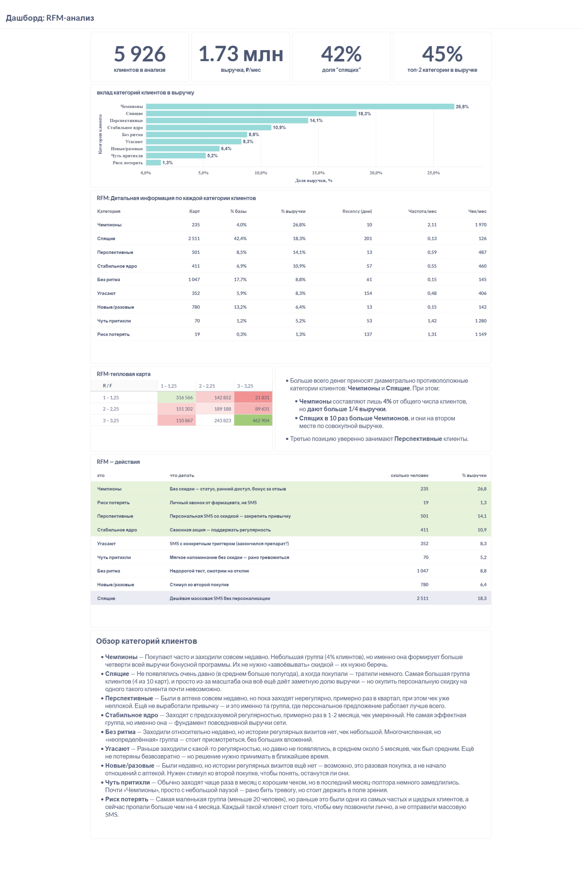
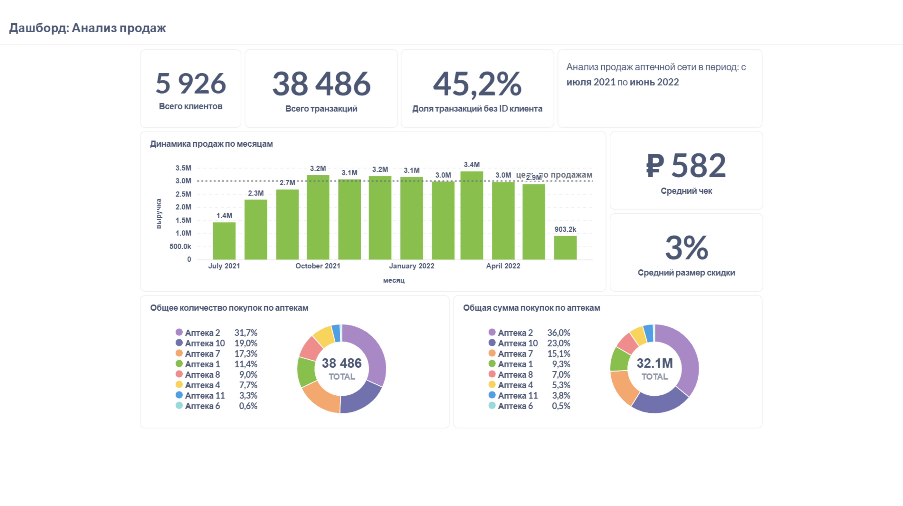

# Кейс: RFM- и ABC-анализ клиентской базы аптечной сети

**Инструменты:** PostgreSQL (DBeaver) — расчёты, Metabase — визуализация и дашборды
**Данные:** транзакции по бонусным картам за ~11 месяцев + продажи по SKU за 1 месяц
**Результат:** 2 дашборда в Metabase, сегментация клиентской базы и товарного портфеля с рекомендациями по департаментам

---

## 1. Контекст и задача

Аптечная сеть (8 точек) хотела понять, на каких клиентах и товарных категориях строится выручка, чтобы:
- точнее нацелить маркетинговые и CRM-активности на разные группы клиентов вместо массовых рассылок,
- дать закупкам, рознице, маркетингу и продажам разные, но согласованные рекомендации по одному и тому же товарному ассортименту.

Для этого я сделал два связанных анализа: **RFM-сегментацию клиентской базы** и **ABC-анализ товарного портфеля**, и собрал по ним два дашборда в Metabase.

## 2. Вопросы, на которые отвечает анализ

- Кто приносит сети основную выручку, и как это соотносится с частотой и давностью покупок?
- Есть ли клиенты на грани ухода, которых имеет смысл возвращать точечно, а не массовой рассылкой?
- Какие товарные позиции дают выручку и прибыль, а какие — балласт для ассортимента?
- Можно ли по каждой товарной группе сформулировать разные, но непротиворечивые действия для закупок, розницы, маркетинга и продаж?

## 3. Данные и вводные ограничения

- **bonuscheques** — транзакции по бонусным картам, период около 332 дней. Нулевых транзакций в базе нет, поэтому фильтр `summ_with_disc > 0` избыточен, но я оставил его явно в финальных запросах для устойчивости к будущим данным.
- **sales** — данные по продажам на уровне SKU (`dr_ndrugs`, `dr_kol`, `dr_croz`, `dr_czak`, `dr_sdisc`, `dr_apt`, `dr_nchk`, `dr_dat`), но только за 1 месяц — этого достаточно для ABC, но недостаточно для сезонного XYZ-анализа.
- Из анализа клиентов исключены транзакции, где вместо номера бонусной карты записана зашифрованная последовательность символов — фильтр `card ~ '^[0-9]+$'`.
- **Важное ограничение, зафиксированное сразу:** около 45% всех транзакций сделаны при офлайн-режиме кассы и не содержат ID клиента — они физически не могут попасть в RFM-анализ. Это системная проблема данных, а не погрешность метода, и она явно вынесена в выводы (раздел 7).

## 4. Логика анализа

### RFM: почему такие границы, а не перцентили

Для Recency, Frequency и Monetary я сначала попробовал перцентильный/терцильный подход — он оказался нерепрезентативным: например, по терцилям в «активную» группу попадали клиенты с покупкой раз в 48 дней, что для аптечной розницы много. Поэтому по каждой метрике перешёл на **экспертные пороги**, обоснованные внешними данными, а не только распределением в самой выборке:

- **Recency**: ≤30 дней — группа 3, 30–90 — группа 2, >90 — группа 1. Границы взял из исследования частоты покупок в аптеках («Мосаптека»), а не из квантилей своей выборки.
- **Frequency**: ≥1 покупки в месяц — группа 3, ≥1 раз в квартал — группа 2, реже — группа 1.
- **Monetary**: здесь важно, что средний чек по `bonuscheques` (834 ₽) и по `sales` (582 ₽) не совпал. Разница объясняется тем, что `sales` учитывает фактическую скидку, а `bonuscheques` — нет. Я проверил это против внешних данных по среднему чеку аптек за 2021–2022 (публично — около 550–650 ₽) и убедился, что 582 ₽ ближе к реальности; тем не менее для сегментации использовал `bonuscheques` (там полный период, а не 1 месяц), заложив пороги 900+ / 300–900 / <300 руб. в месяц.

Дальше 27 потенциальных RFM-сегментов (3×3×3) я сознательно свернул до **9 «персон» по R×F**, где M выражен интенсивностью (цветом) внутри персоны, а не отдельной осью. Это компромисс: полная 27-сегментная матрица точнее, но нечитаема на дашборде и непригодна для конкретных CRM-действий — 9 персон дают наглядную тепловую карту и понятный список действий.

### ABC: почему граница по марже задана не статистически

Для количества и выручки использовал классический кумулятивный ABC (80% / 95% по убыванию). Для маржи тот же подход дал границу категории A на уровне **22,92%** — и в неё попадала половина всех SKU (3312 из ~6600), что бессмысленно для приоритизации. Поэтому границу по марже я задал **экспертно**: A ≥ 30%, B — 15–30%, C < 15%, ориентируясь на данные об средней марже аптек в России в 2026 году (публикация [РБК Компании](https://companies.rbc.ru/news/DPcXKV8TJ1/kak-otkryit-apteku-v-2026-godu-poshagovyij-plan/) — 20–30%). После этого на категорию A пришлось 1786 позиций, на B — около 5000, то есть распределение по третям стало осмысленным.

Перед расчётом также убедился в качестве данных:
- убрал из выборки позицию «ПАКЕТ» — это упаковка, а не лекарство, и по количеству продаж она забивала бы всю статистику;
- проверил на нулевые/отрицательные суммы и количества — отрицательных сумм нет, но есть 4 строки с отрицательным количеством (вероятно, возвраты); решил их не выбрасывать, чтобы не искажать фактическую динамику продаж;
- нашёл 60 задвоенных названий одного и того же артикула — поэтому в группировке использовал код артикула (`dr_cdrugs`), а не название (`dr_ndrugs`), иначе один и тот же товар считался бы как два разных SKU.

Итоговая классификация — по трём измерениям сразу (выручка × маржа × количество), с 27 комбинациями, свёрнутыми в 11 именованных категорий с приоритетом и разными действиями для четырёх департаментов (таблица в разделе 7).

## 5. SQL-запросы

### Запрос 1 — расчёт баллов R, F, M

```sql
with
-- точка отсчёта и длина окна — считаем один раз, используем во всех метриках
period as (
    select
        max(datetime) as snapshot_date,
        (max(datetime)::date - min(datetime)::date) / 30.0 as window_months
    from bonuscheques
    where card ~ '^[0-9]+$'
      and summ_with_disc > 0
),
-- R, F, M за один проход по таблице
card_stats as (
    select
        card,
        extract(day from (select snapshot_date from period) - max(datetime)) as recency_days,
        count(*) as visits_raw,
        sum(summ_with_disc) as total_spend
    from bonuscheques
    where card ~ '^[0-9]+$'
      and summ_with_disc > 0
    group by card
),
-- присваиваем баллы каждой карте
rfm_scores as (
    select
        cs.card, cs.recency_days, cs.visits_raw, cs.total_spend, p.window_months,
        case
            when cs.recency_days <= 30 then 3   -- покупал в последний месяц
            when cs.recency_days <= 90 then 2   -- покупал в последний квартал
            else 1                               -- не покупал более 90 дней
        end as r_score,
        case
            when cs.visits_raw / p.window_months >= 1.0   then 3  -- раз в месяц и чаще
            when cs.visits_raw / p.window_months >= 1/3.0 then 2  -- раз в квартал и чаще
            else 1
        end as f_score,
        case
            when cs.total_spend / p.window_months >= 900 then 3  -- 900+ руб/мес
            when cs.total_spend / p.window_months >= 300 then 2  -- 300–899 руб/мес
            else 1
        end as m_score
    from card_stats cs
    cross join period p   -- period — одна строка, подставляем её к каждой карте
)
select
    r_score, f_score, m_score,
    concat(r_score, f_score, m_score) as rfm_segment,
    count(*) as card_count,
    round(avg(recency_days)) as avg_recency_days,
    round(avg(visits_raw / window_months), 2) as avg_visits_per_month,
    round(avg(total_spend / window_months)) as avg_monthly_spend_rub
from rfm_scores
group by r_score, f_score, m_score
order by r_score desc, f_score desc, m_score desc;
```

### Запрос 2 — свод по «персонам» для дашборда (bar chart + детальная таблица)

```sql
-- rfm_scores — из запроса 1, без m_score (M здесь становится интенсивностью внутри персоны)
with persona as (
    select *,
        case
            when r_score=3 and f_score=3 then 'Чемпионы'
            when r_score=2 and f_score=3 then 'Чуть притихли'
            when r_score=1 and f_score=3 then 'Риск потерять'
            when r_score=3 and f_score=2 then 'Перспективные'
            when r_score=2 and f_score=2 then 'Стабильное ядро'
            when r_score=1 and f_score=2 then 'Угасают'
            when r_score=3 and f_score=1 then 'Новые/разовые'
            when r_score=2 and f_score=1 then 'Без ритма'
            when r_score=1 and f_score=1 then 'Спящие'
        end as persona
    from rfm_scores
)
select
    persona,
    count(*) as card_count,
    round(100.0 * count(*) / sum(count(*)) over (), 1) as pct_of_base,
    round(avg(recency_days)::int, 0) as avg_recency_days,
    round(avg(visits_raw / window_months), 2) as avg_visits_per_month,
    round(avg(total_spend / window_months), 0) as avg_cheque_rub,
    round(100.0 * sum(total_spend / window_months)
        / sum(sum(total_spend / window_months)) over (), 1) as revenue_share_pct
from persona
group by persona
order by revenue_share_pct desc;
```

### Запрос 3 — приоритеты и рекомендуемые действия по сегментам

```sql
with persona as (
    select *,
        case
            when r_score=3 and f_score=3 then 'Чемпионы'
            when r_score=2 and f_score=3 then 'Чуть притихли'
            when r_score=1 and f_score=3 then 'Риск потерять'
            when r_score=3 and f_score=2 then 'Перспективные'
            when r_score=2 and f_score=2 then 'Стабильное ядро'
            when r_score=1 and f_score=2 then 'Угасают'
            when r_score=3 and f_score=1 then 'Новые/разовые'
            when r_score=2 and f_score=1 then 'Без ритма'
            when r_score=1 and f_score=1 then 'Спящие'
        end as persona,
        case
            when r_score=3 and f_score=3 then 1
            when r_score=1 and f_score=3 then 1
            when r_score=3 and f_score=2 then 2
            when r_score=2 and f_score=2 then 2
            when r_score=1 and f_score=2 then 3
            when r_score=2 and f_score=3 then 3
            when r_score=2 and f_score=1 then 4
            when r_score=3 and f_score=1 then 4
            when r_score=1 and f_score=1 then 5
        end as priority,
        case
            when r_score=3 and f_score=3 then 'Без скидки — статус, ранний доступ, бонус за отзыв'
            when r_score=1 and f_score=3 then 'Личный звонок от фармацевта, не SMS'
            when r_score=3 and f_score=2 then 'Персональная SMS со скидкой — закрепить привычку'
            when r_score=2 and f_score=2 then 'Сезонная акция — поддержать регулярность'
            when r_score=1 and f_score=2 then 'SMS с конкретным триггером (закончился препарат?)'
            when r_score=2 and f_score=3 then 'Мягкое напоминание без скидки — рано тревожиться'
            when r_score=2 and f_score=1 then 'Недорогой тест, смотрим на отклик'
            when r_score=3 and f_score=1 then 'Стимул ко второй покупке'
            when r_score=1 and f_score=1 then 'Дешёвая массовая SMS без персонализации'
        end as action
    from rfm_scores   -- из запроса 1
)
select
    persona, priority, action,
    count(*) as card_count,
    round(100.0 * sum(total_spend / window_months)
        / sum(sum(total_spend / window_months)) over (), 1) as revenue_share_pct
from persona
group by persona, priority, action
order by priority, revenue_share_pct desc;
```

### Запрос 4 — доля транзакций без ID клиента по аптекам

```sql
select
    shop,
    date(min(datetime)) as first_date,
    date(max(datetime)) as last_date,
    extract(day from (max(datetime) - min(datetime))) as period_days,
    count(*) as all_transactions,
    count(*) filter (where card ~ '^[0-9]+$') as known_transactions,
    round(
        (count(*) - count(*) filter (where card ~ '^[0-9]+$'))::numeric
        / count(*), 2
    ) as unknown_transactions_share
from bonuscheques
group by shop
order by unknown_transactions_share desc;
```

### Запрос 5 — ABC: проверка данных перед расчётом

```sql
-- "ПАКЕТ" — это упаковка, а не лекарство; убираю, иначе исказит анализ по количеству
select dr_ndrugs, sum(dr_kol)
from sales
where not dr_ndrugs = 'ПАКЕТ'
group by dr_ndrugs
order by sum(dr_kol) desc;

-- аномалии: нулевые/отрицательные количества и выручка
select
    count(distinct dr_ndrugs) as sku_cnt,
    count(*) as total_rows,
    count(*) filter (where dr_kol <= 0) as zero_or_negative_kol,
    min(dr_kol) as min_kol,
    count(*) filter (where dr_croz <= 0) as zero_or_negative_revenue
from sales
where not dr_ndrugs = 'ПАКЕТ';

-- задвоенные названия одного и того же артикула (нашлось 60 строк)
select dr_cdrugs, count(distinct dr_ndrugs) as name_variants
from sales
group by dr_cdrugs
having count(distinct dr_ndrugs) > 1;
```

### Запрос 6 — ABC по трём измерениям и итоговые категории

```sql
with agg_data as (
    select
        dr_cdrugs as artikul,     -- группируем по коду артикула — название задвоено
        dr_ndrugs as name,
        sum(dr_kol) as kol,
        sum((dr_kol * dr_croz) - dr_sdisc) as revenue,
        coalesce(
            nullif(sum(dr_kol * (dr_croz - dr_czak) - dr_sdisc), 0)
            / nullif(sum((dr_kol * dr_croz) - dr_sdisc), 0), 0
        ) as margin
    from sales
    where not dr_ndrugs = 'ПАКЕТ'
    group by dr_cdrugs, dr_ndrugs
),
cumsum_data as (
    select *,
        sum(kol) over (order by kol desc) / sum(kol) over () as cumsum_kol,
        sum(revenue) over (order by revenue desc) / sum(revenue) over () as cumsum_revenue
    from agg_data
),
abc_data as (
    select
        artikul, name, revenue, margin,
        case when cumsum_kol <= 0.8 then 'A' when cumsum_kol <= 0.95 then 'B' else 'C' end as kol_abc,
        case when cumsum_revenue <= 0.8 then 'A' when cumsum_revenue <= 0.95 then 'B' else 'C' end as revenue_abc,
        -- граница по марже — экспертная (см. раздел 4), а не перцентильная
        case when margin >= 0.3 then 'A' when margin >= 0.15 then 'B' else 'C' end as margin_abc
    from cumsum_data
),
abc_final as (
    select artikul, name,
        concat(revenue_abc, margin_abc, kol_abc) as abc_category
    from abc_data
)
select
    artikul, name, abc_category,
    case
        when abc_category in ('AAA','AAB')                 then 'Звёзды'
        when abc_category in ('AAC','BAC')                 then 'Эксклюзив'
        when abc_category in ('ACC')                       then 'Опасно'
        when abc_category in ('ACA','ACB','BCA','BCB')     then 'Опт'
        when abc_category in ('BAA','BAB')                 then 'Скрытые бриллианты'
        when abc_category in ('ABA','ABB','ABC')           then 'Дойные коровы'
        when abc_category in ('BBA','BBB','BBC')           then 'Стабильное ядро'
        when abc_category in ('BCC')                       then 'Под вопросом'
        when abc_category in ('CAA','CAB','CAC')           then 'Нишевые специалисты'
        when abc_category in ('CBA','CBB','CBC')           then 'Хвост без драмы'
        when abc_category in ('CCA','CCB','CCC')           then 'Балласт'
    end as category
from abc_final
order by abc_category;
```

## 6. Дашборды

**Дашборд 1 — RFM-анализ** (плитки для руководства → вклад персон в выручку → детальная таблица → тепловая карта → приоритеты и действия):



**Дашборд 2 — анализ продаж** (вспомогательный: динамика по месяцам, доля неизвестных транзакций, распределение по аптекам — полезен директорам аптек, продаж и закупок отдельно от RFM):



## 7. Выводы и бизнес-рекомендации

**По клиентской базе (RFM):**
- 4% клиентов («Чемпионы») дают почти 27% выручки — классическое распределение Парето.
- «Спящие» — самый крупный сегмент (42% базы), и при этом они всё ещё дают 18% выручки. Тепловая карта показывает, что деньги делают две диаметрально противоположные по поведению группы — «Чемпионы» и «Спящие», а «Перспективные» уверенно держат третье место. Это значит, что стратегия «работать только с лояльными» упускает половину денег, которые приносят как раз нерегулярные клиенты.
- Для каждого из 9 сегментов сформулирован разный канал и посыл — от «без скидки, только статус» для «Чемпионов» до «личный звонок фармацевта» для группы «Риск потерять» (это самая маленькая группа, но именно поэтому персональный контакт там окупается).
- Системная проблема, не решаемая на уровне аналитики: около 45% транзакций происходят в офлайн-режиме кассы и не попадают в анализ вообще. Пока это не исправлено на уровне кассового ПО, любая клиентская аналитика будет строиться на неполных данных — это первая рекомендация, до всех остальных.

**По ассортименту (ABC):**
- 11 именованных категорий с чёткым приоритетом и разными действиями для четырёх департаментов (полная таблица ниже) — от «Звёзды» (ежедневный автозаказ, лучшая полка, скидки под запретом) до «Балласт» (не закупать сверх остатка, распродажа перед выводом).
- Отдельно выделена группа «Опасно» — высокая цена держит товар в топе по выручке, но при этом ни оборота, ни маржи нет: рекомендация — немедленный аудит и заморозка новых закупок, а не автоматическое продолжение закупа по инерции.

| Категория | Приоритет | Закупки | Розница | Маркетинг | Продажи (консультация) |
|---|---|---|---|---|---|
| Звёзды | 1 | Ежедневный автозаказ с учётом срока поставки и страхового запаса | Лучшее место на полке/у кассы, 0% допустимость OOS | Скидки запретить — подарок марже без роста продаж | Не требует активного предложения |
| Эксклюзив | 1 | Малые партии, ручной пересмотр раз в 2 недели | Хранение по спецтребованиям, под заказ | Не продвигать — аудитория слишком узкая | Только по запросу/рецепту |
| Опасно | 1 | Немедленный аудит, заморозить новые закупки | Убрать с «золотой полки» | Уценка для распродажи остатка | Активно предлагать при подходящем запросе |
| Опт | 2 | Крупные партии, регулярный автозаказ | Видное трафикообразующее место | Скидки запретить — маржа на грани | Не тратить время консультации |
| Скрытые бриллианты | 2 | Стандартный автозаказ, следить за ростом спроса | Улучшить выкладку | Приоритет промо-бюджета | Обучить активно рекомендовать |
| Дойные коровы | 3 | Стандартный автозаказ + переговоры о цене | Видимость на уровне «звёзд» | Тест роста цены вместо скидок | Стандартная рекомендация |
| Стабильное ядро | 3 | Стандартный автозаказ | Обычная выкладка | Участвует в общих сезонных акциях | По запросу |
| Под вопросом | 3 | Пересмотр цены поставщика / поиск аналога | Не приоритетное место | Не продвигать до решения по марже | Не делать акцент |
| Нишевые специалисты | 4 | Минимальный, но не нулевой остаток | Не обязательно на полке | Не продвигать — не окупится | Держать в базе знаний на случай запроса |
| Хвост без драмы | 4 | Стандартные правила допоставки | Обычная доступность | Не продвигать | Не требует внимания |
| Балласт | 4 | Не закупать сверх остатка | Освободить место на полке | Финальная распродажа перед выводом | Не рекомендовать активно |

**Сквозной вывод:** результаты ABC имеет смысл использовать как дополнительный фильтр внутри RFM-кампаний — например, при рассылках или звонках сегменту «Перспективные» предлагать конкретно позиции из «Скрытых бриллиантов», а не любые товары.

**По аптекам:** больше половины продаж (и по числу транзакций, и по выручке) приходится всего на 2 точки из 8 (Аптека 2 и Аптека 10). Аптеки 1, 4 и 7 показывают более ⅔ транзакций в офлайн-режиме — это в первую очередь операционная проблема, а не аналитическая находка, но она напрямую ограничивает точность CRM-аналитики именно для этих точек. Аптека 6, похоже, была закрыта в середине периода (данные меньше квартала), Аптека 11 открылась позже остальных (данные за 86 дней) — обе аптеки стоит исключать из сравнительных выводов, а не усреднять наравне с остальными.

## 8. Честные ограничения

- **XYZ-анализ не сделан** — для него нужны данные о продажах минимум за 12 месяцев, чтобы учесть сезонность; в наличии была только 1 месяц продаж по SKU.
- **Дашборд по продажам** сейчас общий; в качестве развития — сделать отдельные вкладки/срезы под конкретные роли (директор аптеки, директор по продажам, директор по закупкам), а не один универсальный вид.
- **Граница по марже в ABC экспертная, а не расчётная** — обоснована одним внешним источником по отрасли; при доступе к внутренним финансовым данным сети (плановая маржинальность, целевая рентабельность по категориям) её стоило бы пересчитать и проверить на реальных финансовых ориентирах компании.
- **Рекомендованные действия по сегментам и категориям — гипотезы, не проверенные экспериментом.** Следующий шаг — A/B-тест хотя бы по 2–3 сегментам (например, «личный звонок» против SMS для группы «Риск потерять»), чтобы подтвердить эффект до масштабирования на всю базу.
- **45% нераспознанных клиентских транзакций** — ограничение, которое аналитика не устраняет, а только фиксирует; итоговые доли выручки по сегментам стоит воспринимать как оценку по видимой части базы, а не как точную картину по всем продажам сети.
